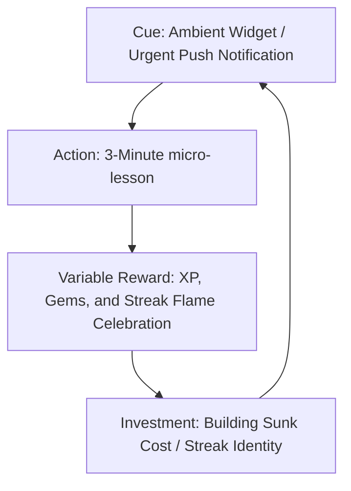
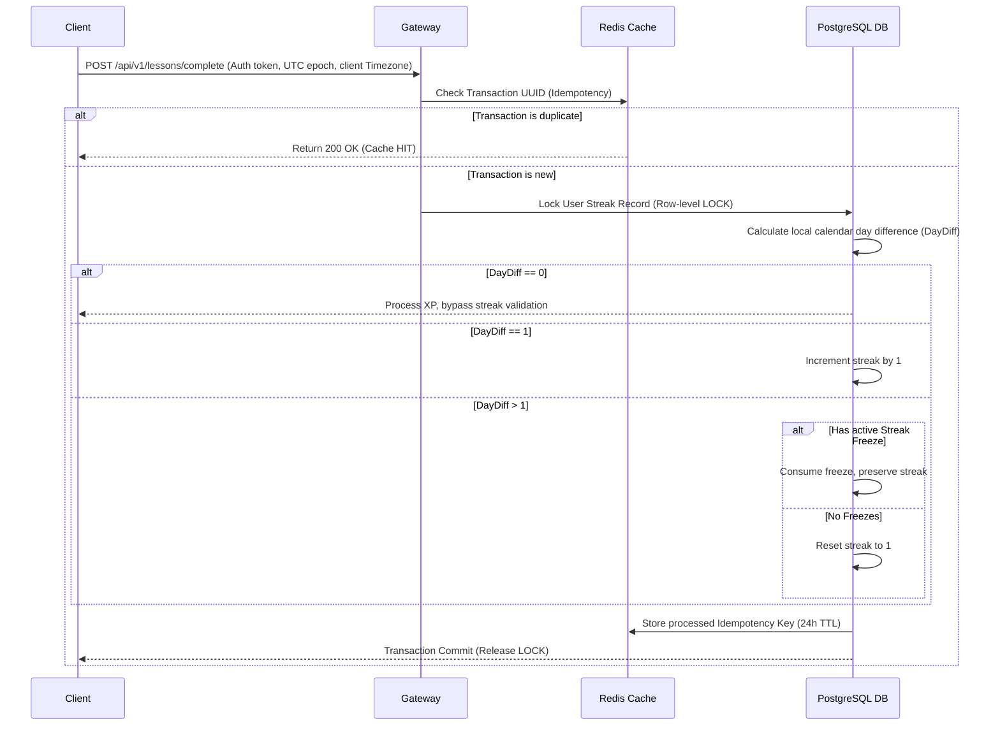
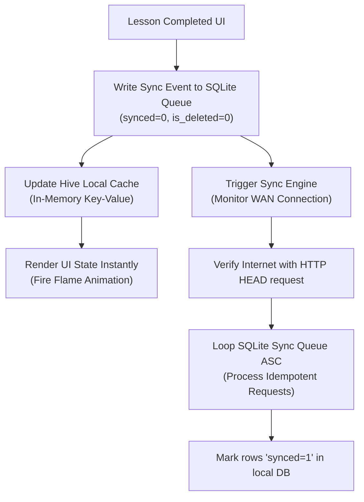

# Architectural & Behavioral Reverse-Engineering of the Duolingo Streak Engine

The daily streak is a premier user retention mechanism in consumer software, transforming a simple daily action into a powerful, self-reinforcing routine. On Duolingo, the streak counter is not a superficial feature; it is the cornerstone of a highly optimized gamification engine designed to maximize daily active users (DAUs) and establish long-term customer lifetime value (LTV).

This analysis provides a comprehensive technical and behavioral breakdown of the Duolingo Streak Engine. It outlines the psychological motivators, backend system architecture, timezone handling strategies, and robust mobile database design patterns required to build a production-grade streak tracking system.

---

## 1. Behavioral Psychology & Monetization Mechanics

### Behavioral Triggers & Habit Loops
The system operates on a continuous feedback loop aligning with cognitive behavioral models:



### Loss Aversion & The Sunk Cost Fallacy
- **Loss Aversion**: Cognitive psychology shows the psychological pain of losing something is roughly twice as powerful as the pleasure of gaining an equivalent reward. Once a user achieves a significant streak (e.g., 100+ days), it represents time, discipline, and personal identity.
- **The "What-The-Hell Effect"**: When a streak is broken, users experience a psychological drop-off where a single missed day leads to complete abandonment of the app. Forgiving safety nets are engineered specifically to combat this churn.

### Micro-Rewards & Celebration Engineering
Completing the first daily lesson rewards the user with immediate positive reinforcement:
- Immediate UI updates (experience points, virtual gems).
- Animated streak counter increments (high-fidelity animations are gated for specific milestones).
- Gating milestones improves **7-day retention in new users by +1.7%**.

### The Layered Engagement Model
- **Streak Society**: Offers structured rewards starting at 7 days and escalating to 365 days (VIP status, custom app icons).
- **Friend Streaks**: Incorporates social accountability. Sharing a streak with a peer makes users **22% more likely** to complete lessons. Users can maintain up to **5 independent Friend Streaks** to mitigate cohort churn.
- **Persistent Widgets**: Emotional home screen widgets transition from relaxed in the morning to frantic as midnight approaches, triggering late-evening urgent notifications during historically active user hours.

### Monetization Channels
- **Streak Freezes**: Passive insurance items purchased in advance using virtual gems.
- **Streak Repairs**: Retroactive cash payments (microtransactions) or premium gem costs offered immediately upon breaking a streak.
- **Subscription Upgrades**: High streak retention serves as a primary funnel for premium subscriptions (Super Duolingo / Duolingo Max). Optimizing pricing of streak-saving items increases premium conversions by up to **9%**.
- **Ad Frequency**: Daily return visits generate up to a **22% increase** in ad impressions.

### Gamification Metrics & Core KPI Benchmarks

| Gamification Metric | Industry Average (EdTech) | Duolingo Target / Optimized Cohort | Behavioral/Business Implications |
| :--- | :--- | :--- | :--- |
| **Day-1 Retention (D1)** | ~20.00% | **72.00%** | Measures onboarding success and Day-1 streak initiation. |
| **Day-7 Retention (D7)** | ~1.76% to 12.00% | **58.00%** | Measures early habit formation; optimized by milestones. |
| **Day-30 Retention (D30)**| < 10.00% | **35.00%** | Establishes user stickiness; correlates to premium conversion. |
| **Post-Streak-Break Churn**| 41.00% | **18.00%** | Measures user loss post-reset. Mitigated by repairs. |
| **Monthly Churn Rate** | 47.00% | **28.00%** | Indicates overall stability of the global user base. |
| **Push Notification Open** | 12.00% | **31.00%** | Performance of ML-scheduled, character-voiced alerts. |
| **MAU Retention** | ~15-20% | **55.00%** | Shows the power of social comparison and leaderboards. |

---

## 2. Technical System Architecture & Resilience

### State Tracking & Daily Goal Verification
Every lesson completion triggers `POST /api/v1/lessons/complete`:



### The Outage Resilience Engine (Big Red Button Pattern)
To handle server outages without resetting streaks:
1. Administrators toggle the **Big Red Button (BRB)** state.
2. The Gateway routes traffic to a highly available static layer (e.g., AWS S3).
3. The static layer logs `user_id` and the `timestamp` of attempt.
4. Post-recovery, offline workers process logs (via AWS Athena) and retroactively apply a **System Freeze** to preserve the streak.

### Database Schema Design (PostgreSQL)

```sql
-- Enums for state safety
CREATE TYPE streak_status_enum AS ENUM ('uninitiated', 'started');
CREATE TYPE freeze_action_type AS ENUM ('purchased', 'equipped', 'consumed', 'admin_override');

-- User profiles with timezone anchoring
CREATE TABLE users (
    id UUID PRIMARY KEY DEFAULT gen_random_uuid(),
    username VARCHAR(50) UNIQUE NOT NULL,
    created_at TIMESTAMP WITH TIME ZONE DEFAULT CURRENT_TIMESTAMP NOT NULL,
    timezone_id VARCHAR(100) DEFAULT 'UTC' NOT NULL, -- IANA Timezone string (e.g., 'Asia/Kolkata')
    timezone_offset_seconds INTEGER DEFAULT 0 NOT NULL, -- Current raw offset (seconds)
    has_premium_access BOOLEAN DEFAULT FALSE NOT NULL
);

-- Core streak counters and aggregates
CREATE TABLE streak_states (
    user_id UUID PRIMARY KEY REFERENCES users(id) ON DELETE CASCADE,
    current_streak INTEGER DEFAULT 0 NOT NULL CHECK (current_streak >= 0),
    longest_streak INTEGER DEFAULT 0 NOT NULL CHECK (longest_streak >= 0),
    active_freezes_count INTEGER DEFAULT 0 NOT NULL CHECK (active_freezes_count >= 0 AND active_freezes_count <= 5),
    last_completed_date DATE, -- Calculated in the user's local timezone (YYYY-MM-DD)
    streak_status streak_status_enum DEFAULT 'uninitiated' NOT NULL,
    updated_at TIMESTAMP WITH TIME ZONE DEFAULT CURRENT_TIMESTAMP NOT NULL
);

-- Fact table for daily activities
CREATE TABLE daily_activities (
    id UUID PRIMARY KEY DEFAULT gen_random_uuid(),
    user_id UUID NOT NULL REFERENCES users(id) ON DELETE CASCADE,
    completed_at_utc TIMESTAMP WITH TIME ZONE NOT NULL, -- Absolute UTC time
    local_date DATE NOT NULL, -- Resolved local date
    lesson_id VARCHAR(100) NOT NULL,
    xp_earned INTEGER DEFAULT 0 NOT NULL,
    client_timezone VARCHAR(100) NOT NULL,
    client_timezone_offset INTEGER NOT NULL
);

-- Indexes for scaling queries
CREATE UNIQUE INDEX idx_user_activity_date ON daily_activities(user_id, local_date);
CREATE INDEX idx_streak_states_current ON streak_states(current_streak DESC);
```

---

## 3. Timezone & Midnight Reset Challenges

### The Legacy Sync Bug
Locking a user's reset boundary to UTC or registration timezone results in broken streaks during travel. 
- *Example*: Seattle user (UTC-8) travels to London (UTC+0).
- If they complete a lesson at 11:30 PM London Time on Dec 1st, the server (locked to UTC-8, converting it to 3:30 PM on Dec 1st) logs it as Dec 1st.
- If they complete the next lesson at 7:30 AM London Time on Dec 3rd, the server converts it to 11:30 PM on Dec 2nd Seattle time. 
- Raw hour differences or crossing the international dateline will trigger false streak breaks.

### Dynamic Resolution
The engine stores absolute time in **UTC** but dynamically processes comparisons against the IANA timezone string and offset sent by the client. Dates are evaluated on local calendar boundaries instead of raw hourly spans:

```python
from datetime import datetime, date
import zoneinfo
from typing import TypedDict, Optional

class StreakState(TypedDict):
    current_streak: int
    longest_streak: int
    active_freezes_count: int
    last_completed_date: Optional[date] # Format: YYYY-MM-DD
    streak_status: str

class VerificationResult(TypedDict):
    action: str  # INCREMENT, NO_OP, CONSUME_FREEZE, RESET
    new_streak_count: int
    freezes_consumed: int
    updated_last_date: Optional[date]

def verify_and_calculate_streak(
    now_utc_epoch: int,
    user_timezone_str: str,
    stored_state: StreakState
) -> VerificationResult:
    # 1. Resolve absolute UTC timestamp to the user's local calendar date
    utc_datetime = datetime.fromtimestamp(now_utc_epoch, zoneinfo.ZoneInfo("UTC"))
    user_tz = zoneinfo.ZoneInfo(user_timezone_str)
    local_datetime = utc_datetime.astimezone(user_tz)
    local_today: date = local_datetime.date()
    
    if stored_state['last_completed_date'] is None:
        return {
            "action": "INCREMENT",
            "new_streak_count": 1,
            "freezes_consumed": 0,
            "updated_last_date": local_today
        }
    
    local_last_date: date = stored_state['last_completed_date']
    day_difference = (local_today - local_last_date).days
    
    # Same-day check-in
    if day_difference == 0:
        return {
            "action": "NO_OP",
            "new_streak_count": stored_state['current_streak'],
            "freezes_consumed": 0,
            "updated_last_date": local_last_date
        }
        
    # Streak continued (Next day)
    elif day_difference == 1:
        return {
            "action": "INCREMENT",
            "new_streak_count": stored_state['current_streak'] + 1,
            "freezes_consumed": 0,
            "updated_last_date": local_today
        }
        
    # Missed day(s)
    else:
        missed_days = day_difference - 1
        available_freezes = stored_state['active_freezes_count']
        
        if available_freezes >= missed_days:
            return {
                "action": "CONSUME_FREEZE",
                "new_streak_count": stored_state['current_streak'] + 1,
                "freezes_consumed": missed_days,
                "updated_last_date": local_today
            }
        else:
            return {
                "action": "RESET",
                "new_streak_count": 1,
                "freezes_consumed": 0,
                "updated_last_date": local_today
            }
```

---

## 4. Client Offline-First Database Structure (Flutter)

To keep UI transitions fast, the app updates a local cache instantly before processing network updates:



### Local Database Helper Implementation

```dart
import 'package:sqflite/sqflite.dart';
import 'package:path/path.dart';

class LocalDatabaseHelper {
  static final LocalDatabaseHelper _instance = LocalDatabaseHelper._internal();
  static Database? _database;
  
  factory LocalDatabaseHelper() => _instance;
  LocalDatabaseHelper._internal();
  
  Future<Database> get database async {
    if (_database != null) return _database!;
    _database = await _initDatabase();
    return _database!;
  }
  
  Future<Database> _initDatabase() async {
    final databasePath = await getDatabasesPath();
    final path = join(databasePath, 'streak_engine_offline.db');
    return await openDatabase(
      path,
      version: 1,
      onCreate: (db, version) async {
        await db.execute('''
          CREATE TABLE local_activities (
            id TEXT PRIMARY KEY,
            lesson_id TEXT NOT NULL,
            xp_earned INTEGER NOT NULL,
            completed_at_utc INTEGER NOT NULL, -- Unix Epoch (ms)
            local_date TEXT NOT NULL -- YYYY-MM-DD
          )
        ''');
        
        await db.execute('''
          CREATE TABLE sync_queue (
            id TEXT PRIMARY KEY, -- Matches Idempotency Key
            payload_json TEXT NOT NULL,
            status TEXT NOT NULL DEFAULT 'PENDING', -- PENDING, RETRYABLE_ERROR, FATAL_ERROR
            retry_count INTEGER NOT NULL DEFAULT 0,
            next_attempt_at INTEGER NOT NULL,
            created_at INTEGER NOT NULL
          )
        ''');
      },
    );
  }

  // Atomic write to activity log & sync queue
  Future<void> queueLessonCompletion(
    String id, 
    String lessonId, 
    int xp, 
    int timestamp, 
    String localDate, 
    String payloadJson
  ) async {
    final db = await database;
    await db.transaction((txn) async {
      await txn.insert(
        'local_activities',
        {
          'id': id,
          'lesson_id': lessonId,
          'xp_earned': xp,
          'completed_at_utc': timestamp,
          'local_date': localDate,
        },
        conflictAlgorithm: ConflictAlgorithm.replace,
      );
      
      await txn.insert(
        'sync_queue',
        {
          'id': id,
          'payload_json': payloadJson,
          'status': 'PENDING',
          'retry_count': 0,
          'next_attempt_at': DateTime.now().millisecondsSinceEpoch,
          'created_at': DateTime.now().millisecondsSinceEpoch,
        },
        conflictAlgorithm: ConflictAlgorithm.replace,
      );
    });
  }
}
```

---

## 5. Top 4 Developer Pitfalls & Mitigation Strategies

### Pitfall 1: Race Conditions in Concurrent Sync Requests
- **Problem**: Reconnecting devices flush multiple sync events rapidly, causing duplicate increments or stale updates.
- **Solution**: Enforce strict idempotency headers (`Idempotency-Key` headers matching client UUIDs) and Optimistic Concurrency Control (OCC) using database version locks:
  ```sql
  UPDATE streak_states SET current_streak = current_streak + 1, version = version + 1
  WHERE user_id = :user_id AND version = :expected_version;
  ```

### Pitfall 2: Daylight Saving Time (DST) Jumps
- **Problem**: Clock adjustments shifts local midnight. Simple 24-hour timestamp verification fails during transitions.
- **Solution**: Execute timezone-aware calendar day arithmetic rather than adding raw seconds. Use zone libraries (e.g., Python's `zoneinfo` or Javascript's `@date-fns/tz`) to evaluate dates based on timezone names.

### Pitfall 3: Client-Side Clock Cheating
- **Problem**: Users shift device system clocks backwards to reclaim streaks.
- **Solution**: Set the server clock as the single source of absolute time, synced via NTP. Reject offline uploads whose timestamps deviate from the server time by more than a set window (e.g., 24 hours).

### Pitfall 4: Thundering Herds & Poison Pill Queue Stalls
- **Problem**: Millions of offline clients flushing queues simultaneously on reconnection will overwhelm databases. Additionally, malformed payloads retry infinitely, blocking subsequent logs.
- **Solution**: Stagger client requests using **Exponential Backoff with Jitter**:
  \[t_{\text{retry}} = \text{min}(t_{\text{max}}, c \cdot 2^{\text{attempt}}) \pm \text{jitter}\]
  Immediately drop invalid payloads (400 Bad Request) into a **Dead Letter Queue (DLQ)** on the client, updating its status to `FATAL_ERROR` to prevent queue locks.